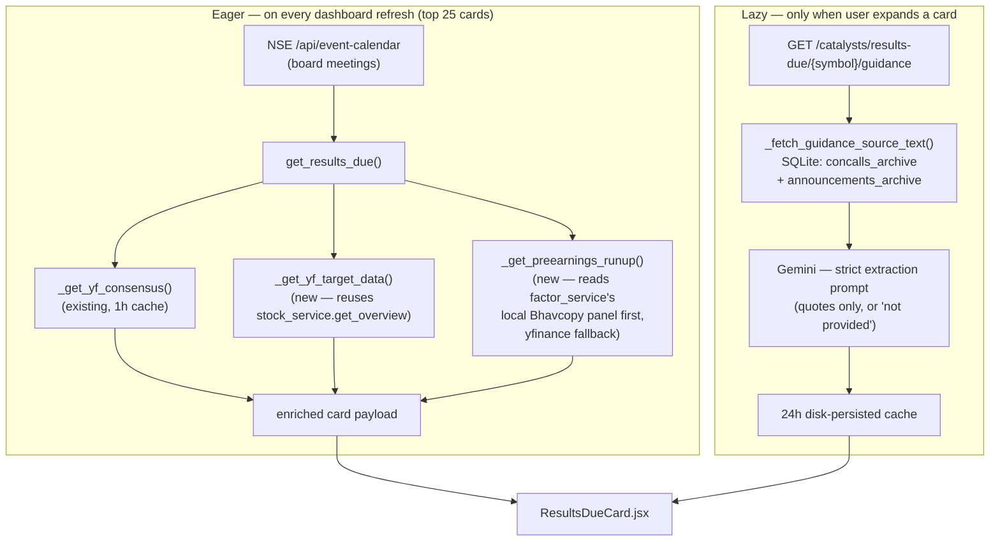

# Result Expectations & Sentiment Tracker — Implementation Plan

**Prepared as:** Lead Software Architect review
**Scope:** `puneetyyadav-rgb/Stock-Analyzer`
**Method:** This plan was written after cloning the repo and reading the actual source — `events_service.py`, `server.py`, `stock_service.py`, `factor_service.py`, `catalyst_archive_service.py`, `concall_service.py`, `ai_service.py`, `CatalystRadarPanel.jsx`, and `api.js` — rather than from the brief alone. Section 1 covers what that audit found, because it changes several parts of the original brief.

A note on `graphify-out/`: I opened `GRAPH_REPORT.md` first, as suggested. It's a whole-corpus community-detection graph (264 files, 3,734 nodes, 165 communities) and it's too coarse for this — it mixes in unrelated vendored crawler code and doesn't reference `events_service.py` or `concalls_archive` by name anywhere in the prose. For a targeted feature like this, reading the actual six files directly and grepping for call sites was faster and more reliable. Everything below is grounded in that direct read.

---

## Table of Contents
1. [Codebase Audit — Read This First](#1-codebase-audit)
2. [Architecture Overview](#2-architecture-overview)
3. [Phase 1 — Fast Math Layer (Consensus, Run-up, Target Upside)](#3-phase-1)
4. [Phase 2 — Dual-Source Gated Guidance Extraction](#4-phase-2)
5. [Phase 3 — Frontend Layout](#5-phase-3)
6. [Response Schema Reference](#6-schema-reference)
7. [Caching & Performance Summary](#7-caching-summary)
8. [Addendum #3 — Future Phase: Annual Report MD&A + CAPEX](#8-future-phase)
9. [Rollout Checklist](#9-rollout-checklist)

---

<a name="1-codebase-audit"></a>
## 1. Codebase Audit — Read This First

| # | Finding | Where | Why it changes the plan |
|---|---------|-------|--------------------------|
| 1 | 🐛 **`events_service.py` currently fails to import.** `Optional[str]` (line 398) and `pd.notna(...)` (line 528+) are used but `typing.Optional` and `pandas` are never imported. | `backend/events_service.py` | Verified, not assumed — I installed the real `requirements.txt` deps in a clean environment and imported the module directly: `NameError: name 'Optional' is not defined`. Since `get_forthcoming_board_meetings()` is on `get_results_due()`'s hot path, this blocks `/api/catalysts/results-due` today. I'm treating the two-line fix as step 0 of Phase 1, since I'm already editing this file's top. |
| 2 | EPS/Revenue consensus is **already implemented**, with a 1-hour cache. | `events_service._get_yf_consensus()` + `_YF_CAL_CACHE` | Brief Section 2A is already ~80% done. Extend it, don't rebuild it. |
| 3 | Analyst target price + recommendation are **already fetched** elsewhere in the app. | `stock_service.get_overview()` → returns `targetMeanPrice`, `targetHighPrice`, `recommendation` (`recommendationKey`), `numAnalysts`, and `price` | Addendum #2 doesn't need a new `yf.Ticker().info` call. Reuse `get_overview()` and compute the delta — one fewer yfinance round trip per stock, which matters given `get_results_due` already fans out to 25 stocks per refresh. |
| 4 | A momentum panel already exists, sourced from the **official NSE Bhavcopy**, not yfinance. | `factor_service.load_panel()` / `_wide()` | This is a faster, more authoritative source for the "10-day run-up" than a fresh `yf.Ticker().history()` call per stock (it's already loaded in memory for the Factor Profile block on the very same card). I'm proposing it as the primary path, with a yfinance fallback for symbols outside the local Bhavcopy universe. |
| 5 | A "management guidance" AI field **already exists** — but it's a loose summary, not a strict extraction. | `concall_service.summarize_concall()` → `managementGuidance: [...]` bullets, built from a broad "extract highlights/concerns/guidance/tone" prompt over the first 25,000 characters | The brief is explicit about zero-hallucination extraction. `summarize_concall`'s prompt allows inference ("3–5 bullets on forward guidance") and reads from the *start* of the transcript, not the Q&A tail. Reusing it here would quietly weaken the guarantee the brief is built around. Phase 2 below is a new, narrower, sibling function — named differently so it's never confused with the existing summary. |
| 6 | There's a second cache layer at the server level with a **disk-persisted 24h tier already reserved for AI results.** | `server.py: _cache_get`/`_cache_set`, prefix allowlist `("ai_ratios", "ai_verdict", "ai_technical", "ai_news", "options_analysis", "concall_summary", "verdict")` | No new SQLite cache table needed for the guidance payload — add one prefix to this existing tuple (2 lines) and it persists across restarts for free, exactly like the existing concall summaries do. |
| 7 | The real frontend cache key is `results_due_cache_{days}`. | `CatalystRadarPanel.jsx:143` | The brief's file-structure notes say `catalyst_results_due_30` — worth fixing in your internal docs, and I've used the real key below. |
| 8 | Cards in `ResultsDueView` are rendered **inline inside `.map()`**, not as a separate component (unlike `CatalystCard` in the other tab, which already is one). | `CatalystRadarPanel.jsx:305-448` | The new Guidance accordion needs its own `useState` (expanded / loading / loaded). That's not possible cleanly inside a bare `.map()`. Phase 3 extracts this into a `ResultsDueCard` component — mirroring the pattern the file already uses elsewhere — as a prerequisite, not an unrelated refactor. |

---

<a name="2-architecture-overview"></a>
## 2. Architecture Overview

Two different cost/latency profiles drive two different loading strategies:

- **Cheap & fast** (consensus, run-up, target upside): pure math or already-cached lookups. These stay **eager** — computed for the nearest 25 cards on every `/api/catalysts/results-due` call, exactly like consensus already is today.
- **Expensive** (management guidance): one SQL scan + one Gemini call per stock. This stays **lazy** — fetched only when a user expands a specific card, via a new dedicated endpoint, then cached hard (24h, disk-persisted) so re-expanding or re-visiting is instant.



---

<a name="3-phase-1"></a>
## 3. Phase 1 — Fast Math Layer (Consensus, Run-up, Target Upside)

### 3.1 Step 0 — Fix the existing import bug

At the top of `backend/events_service.py`:

```python
"""Events calendar (yfinance earnings + NSE board-meeting announcements)."""
import os
import re
import logging
from datetime import date, datetime, timedelta
from typing import Optional          # NEW — fixes the current NameError on get_forthcoming_board_meetings
from dateutil import parser as date_parser
import pandas as pd                   # NEW — fixes the current NameError on pd.notna(...) in get_results_due
import yfinance as yf
from legal_service import get_nse_announcements
```

### 3.2 New cache dictionaries + functions in `events_service.py`

Insert this block right after the existing `_get_yf_consensus()` function (around line 440), so all the yfinance-adjacent enrichment helpers stay together:

```python
# =====================================================================
# PHASE 5: RESULT EXPECTATIONS & SENTIMENT TRACKER — fast math layer
# =====================================================================

_YF_TARGET_CACHE = {}
_RUNUP_CACHE = {}


def _get_yf_target_data(clean_sym: str) -> dict:
    """Analyst target price + recommendation, 1h cache. Deliberately reuses
    stock_service.get_overview() instead of issuing a second yfinance .info
    call — that function already fetches targetMeanPrice/recommendationKey."""
    import time
    now = time.time()
    if clean_sym in _YF_TARGET_CACHE:
        entry = _YF_TARGET_CACHE[clean_sym]
        if now - entry["time"] < 3600:
            return entry["data"]

    data = {
        "current_price": None,
        "target_mean_price": None,
        "recommendation_key": None,
        "num_analysts": None,
        "target_upside_pct": None,
    }
    try:
        import stock_service as ss
        ov = ss.get_overview(clean_sym)
        price = ov.get("price")
        target = ov.get("targetMeanPrice")
        data["current_price"] = price
        data["target_mean_price"] = target
        data["recommendation_key"] = ov.get("recommendation")
        data["num_analysts"] = ov.get("numAnalysts")
        if price and target and price > 0:
            data["target_upside_pct"] = round(((target - price) / price) * 100.0, 2)
    except Exception as e:
        logger.error(f"yf target data error for {clean_sym}: {e}")

    _YF_TARGET_CACHE[clean_sym] = {"time": now, "data": data}
    return data


def _classify_runup(pct) -> dict:
    """Maps the 10-day pre-earnings run-up to the brief's three badge tiers."""
    if pct is None:
        return {"label": "Unknown", "emoji": "❔", "tone": "gray"}
    if pct > 8.0:
        return {"label": "High Hype / Run-up", "emoji": "🔥", "tone": "red"}
    if pct < -5.0:
        return {"label": "Low Bar / Depressed", "emoji": "❄️", "tone": "blue"}
    return {"label": "Neutral", "emoji": "⚖️", "tone": "gray"}


def _get_preearnings_runup_from_panel(clean_sym: str, window: int = 10):
    """PRIMARY path. factor_service already loads the full NSE Bhavcopy close-price
    panel in memory for the Factor Profile block on this same card — reusing it here
    means zero extra network calls, and the run-up figure is methodologically
    consistent with the mom_20d figure shown a few pixels away on the UI."""
    try:
        import factor_service as fs
        panel = fs.load_panel()
        wc = fs._wide(panel, "close")
        if clean_sym not in wc.columns:
            return None
        series = wc[clean_sym].dropna()
        if len(series) <= window:
            return None
        latest, prior = series.iloc[-1], series.iloc[-1 - window]
        if not prior or pd.isna(prior) or pd.isna(latest):
            return None
        return round(((latest / prior) - 1.0) * 100.0, 2)
    except Exception as e:
        logger.debug(f"panel run-up lookup failed for {clean_sym}: {e}")
        return None


def _get_preearnings_runup_from_yfinance(clean_sym: str, window: int = 10):
    """FALLBACK path — only hit when the symbol isn't in the local Bhavcopy universe
    yet (e.g. a very recent listing). Mirrors the auto_adjust=True convention used
    elsewhere in stock_service.py for return-style (not level-style) calculations."""
    try:
        hist = yf.Ticker(f"{clean_sym}.NS").history(period="1mo", interval="1d", auto_adjust=True)
        closes = hist["Close"].dropna() if not hist.empty else hist
        if len(closes) <= window:
            return None
        latest, prior = float(closes.iloc[-1]), float(closes.iloc[-1 - window])
        if not prior:
            return None
        return round(((latest / prior) - 1.0) * 100.0, 2)
    except Exception as e:
        logger.debug(f"yfinance run-up fallback failed for {clean_sym}: {e}")
        return None


def _get_preearnings_runup(clean_sym: str) -> dict:
    import time
    now = time.time()
    if clean_sym in _RUNUP_CACHE:
        entry = _RUNUP_CACHE[clean_sym]
        if now - entry["time"] < 3600:
            return entry["data"]

    pct = _get_preearnings_runup_from_panel(clean_sym)
    source = "bhavcopy_panel"
    if pct is None:
        pct = _get_preearnings_runup_from_yfinance(clean_sym)
        source = "yfinance_fallback"

    data = {"runup_pct": pct, "source": source if pct is not None else None, **_classify_runup(pct)}
    _RUNUP_CACHE[clean_sym] = {"time": now, "data": data}
    return data
```

### 3.3 Wire it into `get_results_due()`

This is a small diff to the existing enrichment block — same `ThreadPoolExecutor`, same `cards[:25]` cap, just three lookups per stock instead of one:

```python
    # Enrich top 25 nearest cards with yfinance consensus + target upside +
    # pre-earnings run-up, concurrently (~1-2s total; run-up prefers the
    # in-memory Bhavcopy panel so it adds almost no extra latency)
    def _fetch_expectations(card):
        sym = card["symbol"]
        c = _get_yf_consensus(sym)
        card["consensus"] = c if c else None
        card["target_data"] = _get_yf_target_data(sym)
        card["runup"] = _get_preearnings_runup(sym)
        return card

    with ThreadPoolExecutor(max_workers=8) as pool:
        cards[:25] = list(pool.map(_fetch_expectations, cards[:25]))
```

This replaces the existing `_fetch_consensus` closure and its `pool.map(...)` call one-for-one — nothing else in `get_results_due()` changes, and the outer `/api/catalysts/results-due` route in `server.py` needs **no changes** for this phase; the response shape just grows three new keys per card.

---

<a name="4-phase-2"></a>
## 4. Phase 2 — Dual-Source Gated Guidance Extraction

### 4.1 Data access — SQL, with a deliberate defensive step

`announcements_archive.date_published` is stored as raw text straight from NSE's API (`an_dt`/`date` fields), not normalized to ISO format — so `ORDER BY date_published DESC` in SQL is not guaranteed to return the true latest row. `events_service.py` already has a `_parse_date()` helper for exactly this kind of messy date text (it's what powers the Phase 2 catalyst-date extraction). Reuse it here rather than trusting SQL string ordering:

```python
def _select_latest_by_parsed_date(rows: list, date_key: str):
    """SQL ORDER BY on date_published isn't reliable (raw NSE text, not ISO).
    Pull a small batch, then use the module's own _parse_date() to find the
    true most-recent row."""
    best, best_date = None, None
    for row in rows:
        d = _parse_date(row.get(date_key))
        if d and (best_date is None or d > best_date):
            best_date, best = d, row
    return best or (rows[0] if rows else None)


def _fetch_guidance_source_text(symbol: str) -> dict:
    """Dual-source fetch per Addendum #1: latest concall transcript tail +
    latest Investor Presentation / Press Release. Both tables are already
    populated by catalyst_archive_service.archive_nse_announcements() and
    the concall archival job — this function is read-only, no network calls."""
    import sqlite3
    from extra_service import _strip_symbol
    import catalyst_archive_service as cas

    clean_sym = _strip_symbol(symbol)
    conn = cas.get_db_connection()   # existing helper — sqlite3.Row factory already set
    try:
        transcript_rows = conn.execute(
            """SELECT quarter_label, full_text, date_published
               FROM concalls_archive WHERE symbol = ?
               ORDER BY date_published DESC, id DESC LIMIT 5""",
            (clean_sym,)
        ).fetchall()
        transcript_row = _select_latest_by_parsed_date([dict(r) for r in transcript_rows], "date_published")

        ann_rows = conn.execute(
            """SELECT subject, full_text, date_published FROM announcements_archive
               WHERE symbol = ? AND (subject LIKE '%Investor Presentation%'
                                      OR subject LIKE '%Press Release%')
               ORDER BY date_published DESC, id DESC LIMIT 10""",
            (clean_sym,)
        ).fetchall()
        ann_row = _select_latest_by_parsed_date([dict(r) for r in ann_rows], "date_published")
    finally:
        conn.close()

    # Brief spec: "final 2-3 pages / Q&A" -> the TAIL of the transcript, not the
    # head. This is the opposite slice from concall_service.summarize_concall(),
    # which intentionally takes transcript_text[:25000] for a different purpose
    # (a holistic summary). Do not reuse that slice here.
    transcript_excerpt = ""
    if transcript_row and transcript_row.get("full_text"):
        text = transcript_row["full_text"]
        transcript_excerpt = text[-7000:] if len(text) > 7000 else text

    announcement_excerpt, announcement_label = "", None
    if ann_row and ann_row.get("full_text"):
        announcement_excerpt = ann_row["full_text"][:6000]
        subj_lower = (ann_row.get("subject") or "").lower()
        announcement_label = "Investor Presentation" if "presentation" in subj_lower else "Press Release"

    return {
        "transcript_excerpt": transcript_excerpt,
        "transcript_quarter": transcript_row.get("quarter_label") if transcript_row else None,
        "announcement_excerpt": announcement_excerpt,
        "announcement_label": announcement_label,
        "announcement_subject": ann_row.get("subject") if ann_row else None,
    }
```

### 4.2 The extraction prompt

Written in the same register as the codebase's existing strict prompts (`CATALYST_CLASSIFY_PROMPT` in this file, `RATIO_ANALYZER_PROMPT` in `ai_service.py`) — numbered hard rules, an explicit "say so honestly" escape hatch, JSON-only output:

```python
GUIDANCE_EXTRACTION_PROMPT = """You are a STRICT DATA EXTRACTION engine for an Indian equity research terminal.
You are NOT a financial analyst. You must not summarize, interpret, or predict.

SOURCE MATERIAL below is (a) an excerpt from the company's most recent earnings call
transcript (closing remarks / Q&A tail), and/or (b) the most recent Investor
Presentation or Press Release filed with the exchange. Either source may be empty.

TASK: Extract ONLY officially, explicitly stated numerical targets or guidance for the
NEXT quarter or NEXT fiscal year (revenue growth %, margin target, capacity target,
volume guidance, EPS target, etc).

HARD RULES:
1. Do NOT infer, calculate, round, or extrapolate any number not stated verbatim.
2. Do NOT summarize sentiment, tone, or outlook in prose.
3. Do NOT invent a target because the text "sounds bullish" or "sounds bearish."
4. If a target appears in both sources, list both occurrences separately with their source.
5. If NO explicit numerical guidance exists in the text provided, set "guidance_found"
   to false and "statements" to an empty array. Do not guess.
6. Output STRICT JSON only. No markdown fences, no commentary outside the JSON object.

Schema:
{
  "guidance_found": true | false,
  "statements": [
    {
      "source": "Earnings Call Transcript" | "Investor Presentation" | "Press Release",
      "metric": "short label, e.g. Revenue Growth Target",
      "quote": "the exact sentence stating the target, verbatim from the source text"
    }
  ]
}

SOURCE TEXT:
{combined_text}
"""
```

### 4.3 Orchestration function in `events_service.py`

Follows the same `asyncio.to_thread` + fence-stripping pattern as the existing `classify_catalyst_events()` in this same file:

```python
async def extract_management_guidance(symbol: str, force_refresh: bool = False) -> dict:
    """Strictly-gated dual-source guidance extraction (Addendum #1). The only
    network call is the single Gemini request — both sources are local archive
    reads, so this is cheap to retry and safe to cache hard."""
    import asyncio as _asyncio
    import json as _json
    from ai_service import sync_generate_verdict, _has_any_ai_key

    sources = await _asyncio.to_thread(_fetch_guidance_source_text, symbol)

    if not sources["transcript_excerpt"] and not sources["announcement_excerpt"]:
        return {
            "guidance_found": False,
            "statements": [],
            "note": "No concall transcript or Investor Presentation/Press Release found in the local archive for this symbol.",
        }

    if not _has_any_ai_key():
        return {"error": "Neither GEMINI_API_KEY nor GROQ_API_KEY is configured"}

    parts = []
    if sources["transcript_excerpt"]:
        q = sources["transcript_quarter"] or "latest"
        parts.append(f"--- EARNINGS CALL TRANSCRIPT ({q}, closing remarks/Q&A excerpt) ---\n{sources['transcript_excerpt']}")
    if sources["announcement_excerpt"]:
        parts.append(f"--- LATEST {sources['announcement_label'] or 'FILING'}: \"{sources['announcement_subject']}\" ---\n{sources['announcement_excerpt']}")

    prompt = GUIDANCE_EXTRACTION_PROMPT.replace("{combined_text}", "\n\n".join(parts))

    try:
        text = (await _asyncio.to_thread(sync_generate_verdict, prompt)).strip()
        if text.startswith("```"):
            text = text.split("\n", 1)[1] if "\n" in text else text[3:]
            if text.endswith("```"):
                text = text[:-3]
            text = text.strip()
        result = _json.loads(text)
        result.setdefault("guidance_found", bool(result.get("statements")))
        result.setdefault("statements", [])
        return result
    except Exception as e:
        logger.error(f"guidance extraction error for {symbol}: {e}")
        return {"error": str(e), "guidance_found": False, "statements": []}
```

*(`sync_generate_verdict` already forces `response_mime_type="application/json"` on the Gemini call and falls back to Groq on 429/503 — see `ai_service.py:86-137` — so the fence-stripping above is a defensive no-op on the Gemini path and a real safety net only on the Groq fallback path, which doesn't have native JSON mode on every model.)*

### 4.4 New endpoint in `server.py`

Insert directly after the existing `get_results_due_route` (around line 843):

```python
@api_router.get("/catalysts/results-due/{symbol}/guidance")
async def get_management_guidance(symbol: str, force_refresh: bool = False):
    """Phase 5: strictly-gated dual-source (concall transcript + Investor
    Presentation/Press Release) extraction of explicit management guidance.
    Deliberately NOT bundled into /catalysts/results-due — that would mean one
    Gemini call per visible card on every 10-minute cache refresh. This is
    lazy-loaded per card instead."""
    key = f"guidance_extract:{symbol.upper()}"
    if not force_refresh:
        cached = _cache_get(key, custom_ttl=86400)  # guidance is stable until the next concall
        if cached:
            return cached
    import events_service as es
    result = await es.extract_management_guidance(symbol, force_refresh)
    _cache_set(key, result)
    return result
```

### 4.5 Extend the disk-cache prefix allowlist

Two one-line edits in `server.py`, so this new key gets the same 24h disk-persisted treatment `concall_summary` already gets — no new SQLite table required:

```python
# in _cache_get():
if any(key.startswith(k) for k in ("ai_ratios", "ai_verdict", "ai_technical", "ai_news",
                                     "options_analysis", "concall_summary", "verdict",
                                     "guidance_extract")):   # NEW

# in _cache_set(): same tuple, same addition
```

---

<a name="5-phase-3"></a>
## 5. Phase 3 — Frontend Layout

### 5.1 `frontend/src/lib/api.js`

One addition, matching the file's existing arrow-function convention exactly:

```javascript
export const getManagementGuidance = (sym, forceRefresh = false) =>
  client.get(`/catalysts/results-due/${sym}/guidance`, { params: { force_refresh: forceRefresh } }).then((r) => r.data);
```

### 5.2 `CatalystRadarPanel.jsx` — extract `ResultsDueCard`, add three blocks

Per audit finding #8, the card JSX currently lives inline inside `filtered.map(...)`. Pull it out into its own component (this is what lets the Guidance accordion have its own local state), then replace the `.map()` call with a one-liner.

**Replace this** (the `filtered.map((card, idx) => { ... })` block, lines ~305–448) **with:**

```jsx
{filtered.map((card, idx) => (
  <ResultsDueCard key={`${card.symbol}-${card.meeting_date}-${idx}`} card={card} />
))}
```

**And add this new component** above `ResultsDueView` (or in its own file if you'd rather keep `CatalystRadarPanel.jsx` from growing further — either works, no logic changes either way). Everything through the Factor Snapshot block is your existing JSX, unchanged, just relocated; the three new blocks are appended after it:

```jsx
function ResultsDueCard({ card }) {
  const [guidance, setGuidance] = useState({ status: "idle", data: null });

  const badgeBg = card.badge_color === "red" ? "rgba(239,68,68,0.15)" :
                  card.badge_color === "green" ? "rgba(34,197,94,0.15)" :
                  card.badge_color === "purple" ? "rgba(168,85,247,0.15)" : "rgba(59,130,246,0.15)";
  const badgeBorder = card.badge_color === "red" ? "#ef4444" :
                      card.badge_color === "green" ? "#22c55e" :
                      card.badge_color === "purple" ? "#a855f7" : "#3b82f6";
  const badgeColor = card.badge_color === "red" ? "#fca5a5" :
                     card.badge_color === "green" ? "#86efac" :
                     card.badge_color === "purple" ? "#d8b4fe" : "#93c5fd";

  const runupTone = { red: { bg: "rgba(239,68,68,0.1)", border: "#ef4444", color: "#fca5a5" },
                      blue: { bg: "rgba(56,189,248,0.1)", border: "#38bdf8", color: "#7dd3fc" },
                      gray: { bg: "rgba(100,116,139,0.1)", border: "#64748b", color: "#cbd5e1" } }[card.runup?.tone] || {};

  const recoKey = card.target_data?.recommendation_key || "";
  const recoColor = recoKey.includes("buy") ? "#4ade80" : recoKey.includes("sell") ? "#f87171" : "#fbbf24";

  const loadGuidance = async () => {
    if (guidance.status === "loading" || guidance.status === "loaded") return;
    setGuidance({ status: "loading", data: null });
    try {
      const res = await getManagementGuidance(card.symbol);
      setGuidance({ status: "loaded", data: res });
    } catch (err) {
      setGuidance({ status: "error", data: { error: err.message || "Failed to extract guidance" } });
    }
  };

  return (
    <div style={{
      background: "rgba(15, 23, 42, 0.75)", border: "1px solid rgba(51, 65, 85, 0.6)",
      borderRadius: 12, padding: 16, display: "flex", flexDirection: "column",
      justifyContent: "space-between", boxShadow: "0 4px 12px rgba(0,0,0,0.25)",
      transition: "border-color 0.2s ease",
    }}>
      <div>
        {/* --- Top bar, date/countdown, purpose, consensus block, factor snapshot ---
             --- Unchanged from the current implementation — see CatalystRadarPanel.jsx:332-444 --- */}

        {/* NEW — Pre-Earnings Hype / Run-up (Brief Section 2B) */}
        {card.runup && card.runup.runup_pct !== null && (
          <div style={{
            background: runupTone.bg, border: `1px solid ${runupTone.border}55`, borderRadius: 8,
            padding: "6px 10px", marginTop: 10, fontSize: 11, color: runupTone.color,
            display: "flex", justifyContent: "space-between", alignItems: "center",
          }}>
            <span style={{ fontWeight: 700 }}>{card.runup.emoji} {card.runup.label}</span>
            <span>{card.runup.runup_pct > 0 ? "+" : ""}{card.runup.runup_pct}% / 10d</span>
          </div>
        )}

        {/* NEW — Analyst Target Upside (Addendum #2) */}
        {card.target_data && card.target_data.target_upside_pct !== null && (
          <div style={{
            background: "rgba(14, 165, 233, 0.08)", border: "1px solid rgba(14, 165, 233, 0.25)",
            borderRadius: 8, padding: "6px 10px", marginTop: 8, fontSize: 11,
            display: "flex", justifyContent: "space-between", alignItems: "center",
          }}>
            <span style={{ color: "#7dd3fc", fontWeight: 700 }}>
              🎯 Target Upside:{" "}
              <span style={{ color: card.target_data.target_upside_pct >= 0 ? "#4ade80" : "#f87171" }}>
                {card.target_data.target_upside_pct > 0 ? "+" : ""}{card.target_data.target_upside_pct}%
              </span>
            </span>
            {card.target_data.recommendation_key && (
              <span style={{ color: recoColor, fontWeight: 700, textTransform: "uppercase", fontSize: 10 }}>
                {card.target_data.recommendation_key.replace("_", " ")}
              </span>
            )}
          </div>
        )}

        {/* NEW — Management Guidance, lazy-loaded accordion (Brief Section 2C + Addendum #1) */}
        <div style={{ marginTop: 8 }}>
          <button
            onClick={loadGuidance}
            style={{
              width: "100%", textAlign: "left", background: "rgba(244,114,182,0.08)",
              border: "1px solid rgba(244,114,182,0.25)", borderRadius: 8, padding: "6px 10px",
              color: "#f9a8d4", fontSize: 11, fontWeight: 700, cursor: "pointer",
            }}
          >
            {guidance.status === "loading" ? "⏳ Reading transcript + filings..." :
             guidance.status === "loaded" ? "🎙️ Management Guidance ▾" :
             "🎙️ Management Guidance (click to extract) ▸"}
          </button>

          {guidance.status === "loaded" && guidance.data && (
            <div style={{ marginTop: 6, padding: "8px 10px", background: "rgba(15,23,42,0.5)", borderRadius: 8, fontSize: 11, color: "#e2e8f0" }}>
              {guidance.data.error ? (
                <span style={{ color: "#f87171" }}>⚠️ {guidance.data.error}</span>
              ) : !guidance.data.guidance_found ? (
                <span style={{ color: "#64748b" }}>No numerical guidance provided in the latest transcript or filings.</span>
              ) : (
                guidance.data.statements.map((s, i) => (
                  <div key={i} style={{ marginBottom: i < guidance.data.statements.length - 1 ? 8 : 0 }}>
                    <div style={{ color: "#94a3b8", fontSize: 9.5, textTransform: "uppercase", fontWeight: 700, marginBottom: 2 }}>
                      {s.source} · {s.metric}
                    </div>
                    <div style={{ fontStyle: "italic", lineHeight: 1.4 }}>&ldquo;{s.quote}&rdquo;</div>
                  </div>
                ))
              )}
            </div>
          )}
        </div>
      </div>
    </div>
  );
}
```

### 5.3 Why this doesn't clutter the card

- The eager blocks (Run-up, Target Upside) follow the **exact same visual grammar** the card already uses for Consensus and Factor Snapshot — tinted `rgba(...,0.08)` background, `rgba(...,0.25)` border, 11px type. They read as one family, not three bolted-on widgets.
- Guidance is the one block genuinely worth hiding by default: quoted transcript text is long and variable-length, and it's the one piece of data that costs real API quota to produce. Collapsed-by-default with a one-line trigger keeps the card's baseline height identical to today's, and the cost is only paid for cards a person actually opens.
- Color is meaningful, not decorative: red/blue/gray on the run-up badge mirrors its own classification (not the unrelated `event_type` badge colors already used up top), and the recommendation pill re-uses the same green/amber/red logic a trader would expect from any "Buy/Hold/Sell" tag elsewhere in finance UI.

---

<a name="6-schema-reference"></a>
## 6. Response Schema Reference

**`GET /api/catalysts/results-due` — each card gains three keys** (all `null`-safe; unenriched cards past index 25 simply omit real values):

```jsonc
{
  "symbol": "TCS",
  "company": "Tata Consultancy Services",
  "meeting_date": "2026-07-24",
  "countdown_days": 8,
  "event_type": "Financial Results",
  "consensus": { "eps_avg": 32.4, "eps_high": 33.1, "eps_low": 31.8, "rev_avg_cr": 64500.0 },
  "factor_snapshot": { "composite": 1.12, "decile": 8, "percentile": 78.3, "deliv_pct": 44.2, "vol_trend": 1.3, "mom_20d": 4.7, "adv_cr": 210.5 },

  // NEW below this line
  "target_data": {
    "current_price": 4120.5,
    "target_mean_price": 4400.0,
    "recommendation_key": "buy",
    "num_analysts": 38,
    "target_upside_pct": 6.79
  },
  "runup": {
    "runup_pct": 9.4,
    "source": "bhavcopy_panel",
    "label": "High Hype / Run-up",
    "emoji": "🔥",
    "tone": "red"
  }
}
```

**`GET /api/catalysts/results-due/{symbol}/guidance`** (new endpoint, lazy):

```jsonc
{
  "guidance_found": true,
  "statements": [
    {
      "source": "Earnings Call Transcript",
      "metric": "Revenue Growth Target (FY27)",
      "quote": "We are guiding to 12 to 14 percent constant-currency revenue growth for the full year."
    },
    {
      "source": "Investor Presentation",
      "metric": "EBIT Margin Target",
      "quote": "Management reiterated its EBIT margin band of 24 to 26 percent."
    }
  ]
}
```

---

<a name="7-caching-summary"></a>
## 7. Caching & Performance Summary

| Data | Cache layer | TTL | Scope | Notes |
|---|---|---|---|---|
| Consensus EPS/Revenue | `events_service._YF_CAL_CACHE` (in-memory) | 1h | top 25 cards | already existed |
| Target price / upside | `events_service._YF_TARGET_CACHE` (in-memory, **new**) | 1h | top 25 cards | reuses `stock_service.get_overview()`, no new yfinance endpoint hit |
| Run-up % | `events_service._RUNUP_CACHE` (in-memory, **new**) | 1h | top 25 cards | prefers local Bhavcopy panel (no network call); yfinance only as fallback |
| Whole `results-due` payload | `events_service._RESULTS_DUE_CACHE` + `server.py` `_CACHE` | 10 min / 60 s | all cards | already existed, unchanged |
| Management guidance | `server.py` disk-persisted `_CACHE` (**prefix added**) | 24h | per symbol, on-demand | survives server restarts, same tier as `concall_summary` |

Net new network calls per dashboard refresh: **zero**, if the Bhavcopy panel already contains the symbol (the common case) — run-up reuses in-memory data, and target upside reuses a call pattern (`get_overview`) that already exists elsewhere in the app rather than adding a second `.info` fetch per stock.

---

<a name="8-future-phase"></a>
## 8. Addendum #3 — Future Phase: Annual Report MD&A + CAPEX Cross-Reference

Sketched at roadmap level, as requested — this is explicitly a later phase, not part of this implementation pass.

- **New table**, following the exact shape of `announcements_archive`/`concalls_archive`: `annual_reports_archive(symbol, fiscal_year, mdna_text, full_text_ref, created_at)`.
- **PDF extraction ceiling needs raising.** `catalyst_archive_service._extract_pdf_text_sync()` currently caps at the **first 8 pages** (`reader.pages[:8]`) — fine for a corporate announcement, not for an annual report where the MD&A section commonly starts well past page 30. This needs either a much higher page cap or, better, a heading-detection pass (scan for "Management Discussion and Analysis" / "MD&A" as a section header, then take pages from there to the next major heading) rather than a flat page-count slice.
- **CAPEX/capacity filter**: same `subject LIKE`/`full_text LIKE` pattern already established in Phase 2, against `announcements_archive`, with terms like `%capex%`, `%capacity expansion%`, `%capital expenditure%`, `%brownfield%`, `%greenfield%`.
- **Cross-reference logic**: once both are extracted, a straightforward comparison prompt (same strict-extraction register as Phase 2) that takes the MD&A's stated multi-year targets and the quarterly guidance from Phase 2 side by side and flags only where they're both explicit and appear to diverge — never inferring a contradiction that isn't textually there.

---

<a name="9-rollout-checklist"></a>
## 9. Rollout Checklist

- [ ] `events_service.py` — add `from typing import Optional` + `import pandas as pd` (fixes current import failure)
- [ ] `events_service.py` — add `_YF_TARGET_CACHE`, `_RUNUP_CACHE`, `_get_yf_target_data()`, `_classify_runup()`, `_get_preearnings_runup_from_panel()`, `_get_preearnings_runup_from_yfinance()`, `_get_preearnings_runup()`
- [ ] `events_service.py` — replace `_fetch_consensus` closure in `get_results_due()` with `_fetch_expectations`
- [ ] `events_service.py` — add `_select_latest_by_parsed_date()`, `_fetch_guidance_source_text()`, `GUIDANCE_EXTRACTION_PROMPT`, `extract_management_guidance()`
- [ ] `server.py` — add `GET /catalysts/results-due/{symbol}/guidance`
- [ ] `server.py` — add `"guidance_extract"` to the disk-cache prefix tuple in both `_cache_get()` and `_cache_set()`
- [ ] `frontend/src/lib/api.js` — add `getManagementGuidance()`
- [ ] `CatalystRadarPanel.jsx` — extract `ResultsDueCard` component; add Run-up, Target Upside, and Guidance-accordion blocks; replace the inline `.map()` with `<ResultsDueCard />`
- [ ] Smoke test: confirm `events_service.py` imports cleanly post-fix (`python -c "import events_service"`) before testing the endpoint
- [ ] Manual check: at least one symbol with no `concalls_archive` row and no matching `announcements_archive` subject, to confirm the guidance endpoint returns the graceful "not found" payload rather than erroring
