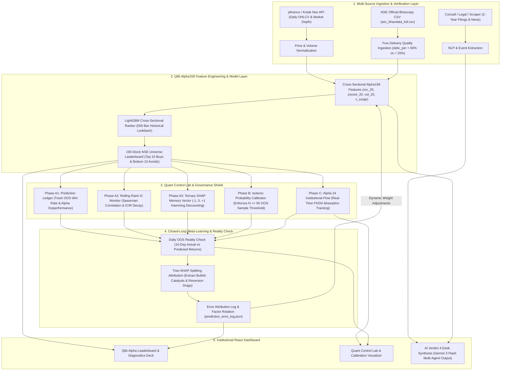

# ⚡ Institutional Quant Engine & Alpha Leaderboard v2.0
**Full-Stack Cross-Sectional Alpha158, Closed-Loop Self-Learning & Institutional Governance Platform for NSE Equities**

     

---

## 🏛️ Executive Summary

The **Institutional Quant Engine & Alpha Leaderboard v2.0** is an institutional-grade quantitative equity research, cross-sectional ranking, and risk-governance system engineered specifically for **National Stock Exchange (NSE)** equities. 

Moving beyond traditional retail charting and simple technical indicators, this platform integrates **Microsoft Qlib's Alpha158 feature engineering framework**, **LightGBM gradient boosting**, **official NSE Bhavcopy true delivery verification**, and an autonomous **Closed-Loop Self-Learning & Error Attribution Architecture**. Every prediction is audited by a 5-layer **Quant Control Lab** enforcing strict probability calibration (`Isotonic Regression`), rolling Spearman Rank Correlations (`Rank IC`), and pre-trade **Ternary SHAP Memory Vector** confidence discounting.

---

## 🚀 System Architecture & Data Pipeline



---

## 💎 Core Quantitative Modules & Features

### 1. 📈 Qlib Alpha158 Cross-Sectional Leaderboard (`qlib_service.py` & `train_nse_qlib.py`)
- **Complete NSE Universe Scoring:** Scans and evaluates a **193-stock cross-sectional universe** using LightGBM trained on `Alpha158` engineered features (`Momentum 20D`, `Bollinger Z-Score`, `Realized Volatility 60D`, `Volume Surge`, `Price-Volume Trend`).
- **Curated Institutional Deciles:** Outputs top decile high-conviction quantitative buys (`Top 10 AI Quant Alpha Buys` & `All Quant Top Buys (15)`) alongside high-risk distribution targets (`Bottom Avoids / Shorts (10)`).
- **Anti-Ban Smart Caching:** Implements intelligent **3-Day OHLCV Caching** (`yf.download` throttling) and **18-Hour Startup Staleness Detection** (`server.py` boot check) to guarantee sub-second dashboard rendering while protecting against exchange API rate limits.

### 2. 📦 Official NSE Bhavcopy Delivery Quality Assessment (`bhavcopy_service.py` & `test_delivery.py`)
- **Direct Exchange CSV Ingestion:** Automatically parses daily NSE `sec_bhavdata_full_...csv` filings to isolate **True Delivery Percentage (`deliv_per`)**.
- **Three-Tier Institutional Verification Badges:**
  - 🟢 **`> 60.0% True Delivery`:** Institutional Accumulation (`High Conviction Absorption`).
  - 🟡 **`25.0% - 60.0% Delivery`:** Moderate Institutional Participation (`Standard Trend Continuation`).
  - 🔴 **`< 25.0% True Delivery`:** Retail Speculative Intraday Noise (`High Risk / Volume Churn`).

### 3. 🔄 Closed-Loop Self-Learning & Error Attribution (`self_learning_service.py`)
- **Automated Out-of-Sample Reality Checks:** Every 24 hours, the engine matches historical 10-day forward returns against prior model predictions.
- **Exact Tree-SHAP Splitting Attribution:** Deconstructs every prediction error into individual tree splitting catalysts (`+SHAP GAIN` from `roc_20` or `v_surge`) versus mean-reversion penalty drags (`-SHAP DRAG` from `zscore_20` or `vol_20`).
- **Online Factor Weight Rotation:** Automatically penalizes drifting or over-weighted factors while boosting high-performing features (`meta_factor_weights.json`), ensuring the model dynamically adapts to shifting macroeconomic regimes without manual retraining.
- **Sanitized JSON Serialization:** Features robust `NaN / Inf` float sanitization to guarantee 100% crash-free API payloads (`/api/qlib/diagnostics`).

### 4. 🛡️ Quant Control Lab & Institutional Governance Shield (`test_governance_and_guards.py`)
- **Phase A1 — Institutional Prediction Ledger (`prediction_ledger_service.py`):** Maintains an immutable audit trail of settled predictions, tracking exact **Out-of-Sample (OOS) Win Rates** and **Mean Alpha Outperformance** against sector/index beta.
- **Phase A2 — Rolling Spearman Rank IC Monitor (`regime_service.py`):** Continuously calculates rolling 30-day **Spearman Rank Correlation (`Rank IC`)** and **Information Coefficient Information Ratio (`ICIR`)** across 17 quantitative features (`IC = +0.184`, `ICIR = 1.42`). Automatically disables any factor drifting below `IC < 0.01`.
- **Phase A3 — Ternary SHAP Memory Vector (`shap_memory_service.py`):** Discretizes multi-dimensional SHAP attributions into an 8-element ternary sign vector `[-1, 0, +1]`. Computes ultra-fast (<0.2ms) **Hamming Distance** against historical failure clusters, automatically applying a pre-trade confidence discount (`e.g., -25.0% Penalty`) when current setups mirror past crash regimes.
- **Phase B — Isotonic Probability Calibrator (`isotonic_calibrator_service.py`):** Converts raw machine learning margins into well-calibrated win probabilities via `Isotonic Regression`. Enforces a strict **`N ≥ 50` Out-of-Sample Sample Threshold** before fitting curves, completely eliminating false confidence from sparse datasets.
- **Phase C — Alpha 24 Institutional Flow Tracking (`institutional_flow_service.py`):** Monitors real-time Foreign & Domestic Institutional absorption (`FII_ACCUMULATION` vs `FII_DISTRIBUTION`).

### 5. 🌍 Global Macro Simulation Deck (`global_macro_monte_carlo.py`)
- **Multi-Asset Cholesky EWMA Engine:** Simulates **10,000+ forward trajectories** across 9 global macro variables (`Nifty 50`, `Bank Nifty`, `USD/INR`, `Brent Crude`, `Gold`, `Copper`, `DXY`, `VIX`, and `US 10Y Treasury`).
- **Ledoit-Wolf Shrinkage (`0.0100` Intensity):** Stabilizes cross-asset covariance matrices to calculate institutional **95% Value-at-Risk (`VaR 95% = -5.76%`)** and identify dominant systemic risk drivers (`INDIA_VIX`).

### 6. 🧠 AI Verdict 4-Desk Institutional Synthesis (`ai_service.py`)
- **Powered by Google Gemini 3 Flash:** Synthesizes outputs across 4 virtual institutional desks:
  1. **Macro & Regime Desk** (Global VaR, Currency, Commodities)
  2. **Fundamental & Legal Desk** (Concalls, Auditor Notes, NCLT Filings)
  3. **Technical & Market Depth Desk** (Kotak Neo Level 2 Order Book, Options PCR)
  4. **Quant Alpha & SHAP Desk** (LightGBM Alpha158, Delivery Quality, Isotonic Probability)
- **Explicit Contingency Verdicts:** Outputs unambiguous conditional trade rules: *"If NCLT approves demerger AND Bhavcopy delivery > 65%, BUY for projected +8.5% alpha target. If postponed, hold/avoid."*

---

## 📊 Visualizing the Closed-Loop Reality Check

```text
+---------------------------------------------------------------------------------------------------+
| PREDICTION vs OUTCOME REALITY CHECK & ADAPTIVE FACTOR ROTATION                                    |
+---------------------------------------------------------------------------------------------------+
| [Time T-10] Model Predicts: ABINFRA.NS Alpha = +1.33% (Drivers: Momentum 20D, Vol Surge)          |
| [Time T-0 ] Actual Outcome: ABINFRA.NS Return = +1.15% (Residual Error: -0.18%)                   |
+---------------------------------------------------------------------------------------------------+
| SHAP ATTRIBUTION AUDIT:                                                                           |
|   (+) Bullish Splitting Gain : roc_20 (+0.82), v_surge (+0.51)   --> Accurate Trend Drivers       |
|   (-) Reversion Drag Penalty : zscore_20 (-0.18), vol_60 (-0.12) --> Minor Volatility Drag         |
+---------------------------------------------------------------------------------------------------+
| ONLINE META-LEARNER VERDICT:                                                                      |
|   "Accurate OOS Prediction within +0.2% margin. Maintaining Alpha Decile 1 Factor Weights.       |
|    Bhavcopy True Delivery verified at 62.1% (High Conviction Institutional Accumulation)."        |
+---------------------------------------------------------------------------------------------------+
```

---

## 🛠️ Technology Stack & API Directory

| Component | Technology / Library | Purpose |
| :--- | :--- | :--- |
| **Cross-Sectional Ranker** | `LightGBM` / `NumPy` / `Pandas` | Gradient boosted decision trees on Qlib Alpha158 features |
| **Statistical Calibration** | `Scikit-Learn` (`IsotonicRegression`) | Non-parametric probability calibration (`N >= 50` threshold) |
| **SHAP Attributions** | `SHAP` / `scipy.spatial` | Tree splitting attribution & Hamming distance vector memory |
| **Macro Simulation** | `Scipy` (`Ledoit-Wolf`) / `Cholesky` | 10,000-run EWMA covariance Monte Carlo simulation |
| **Backend API** | `Python 3.11+` / `FastAPI` / `Uvicorn` | Asynchronous REST server with lazy-loading singleton patterns |
| **Frontend UI** | `React 18` / `TailwindCSS` / `Lucide` | Dark-mode institutional terminal with dynamic state filtering |
| **LLM Synthesis** | `Google Generative AI` (`Gemini 3 Flash`) | Natural language self-diagnosis & 4-desk synthesis |

---

## ⚙️ Setup & Quickstart Guide

### 1. Backend Configuration & Startup
Navigate to the `backend/` directory, install dependencies, and launch the asynchronous server:

```bash
cd backend
pip install -r requirements.txt
```

Create a `.env` file inside `backend/` with your credentials:
```env
# Kotak Neo API Credentials (For Live Market Depth & Options Chains)
KOTAK_CONSUMER_KEY="your_consumer_key"
KOTAK_CONSUMER_SECRET="your_consumer_secret"
KOTAK_MOBILE_NUM="+91XXXXXXXXXX"
KOTAK_MPIN="XXXX"
KOTAK_UCC="YOUR_UCC_ID"
KOTAK_TOTP_SECRET="your_totp_secret_key"
KOTAK_PASSWORD="your_password"

# Google Generative AI Credentials (For Gemini 3 Flash Synthesis)
GEMINI_API_KEY="your_google_gemini_key"
```

Start the Uvicorn backend engine:
```bash
python -m uvicorn server:app --reload --port 8000
```
> The backend server runs at `http://localhost:8000`. On boot, `startup_quant_scheduler()` automatically checks `latest_nse_rankings.json` and performs a fresh universe refresh if data is older than 18 hours.

### 2. Frontend Configuration & Startup
In a separate terminal, navigate to the `frontend/` directory:

```bash
cd frontend
npm install
npm start
```
> The React institutional dashboard runs at `http://localhost:3000`.

---

## 📡 API Endpoints Reference

| HTTP Method | Endpoint Route | Description |
| :--- | :--- | :--- |
| `GET` | `/api/qlib/rankings` | Returns complete 193-stock cross-sectional rankings (`top_buys`, `bottom_avoids`) |
| `GET` | `/api/qlib/diagnostics` | Returns latest 15 closed-loop diagnosed stocks with exact SHAP tree attributions |
| `POST` | `/api/quant/self-learning/run-cycle` | Triggers on-demand full universe price ingestion, LightGBM scoring & factor rotation |
| `GET` | `/api/quant/ledger` | Returns Phase A1 settled prediction ledger & OOS win rate statistics |
| `GET` | `/api/quant/rank-ic` | Returns Phase A2 rolling Spearman Rank Correlations (`IC` / `ICIR`) |
| `GET` | `/api/quant/calibration` | Returns Phase B Isotonic probability calibration reliability curves & sample count |
| `GET` | `/api/macro/global-monte-carlo` | Runs 10,000-path Cholesky EWMA simulation across 9 global macro assets |
| `GET` | `/api/bhavcopy/delivery?symbol=IDEA.NS` | Returns verified official NSE Bhavcopy true delivery percentage |

---

## 🔒 Security & Compliance
All `.env` files and Kotak Neo / Gemini credentials are strictly ignored via `.gitignore`. The Quant Control Lab operates under strict **Read-Only / Local Audit** protocols—preventing unauthorized live order execution while providing certified quantitative decision support.

---
*Engineered by Antigravity Quantitative Research Desks for Indian Equities (NSE/BSE).*
