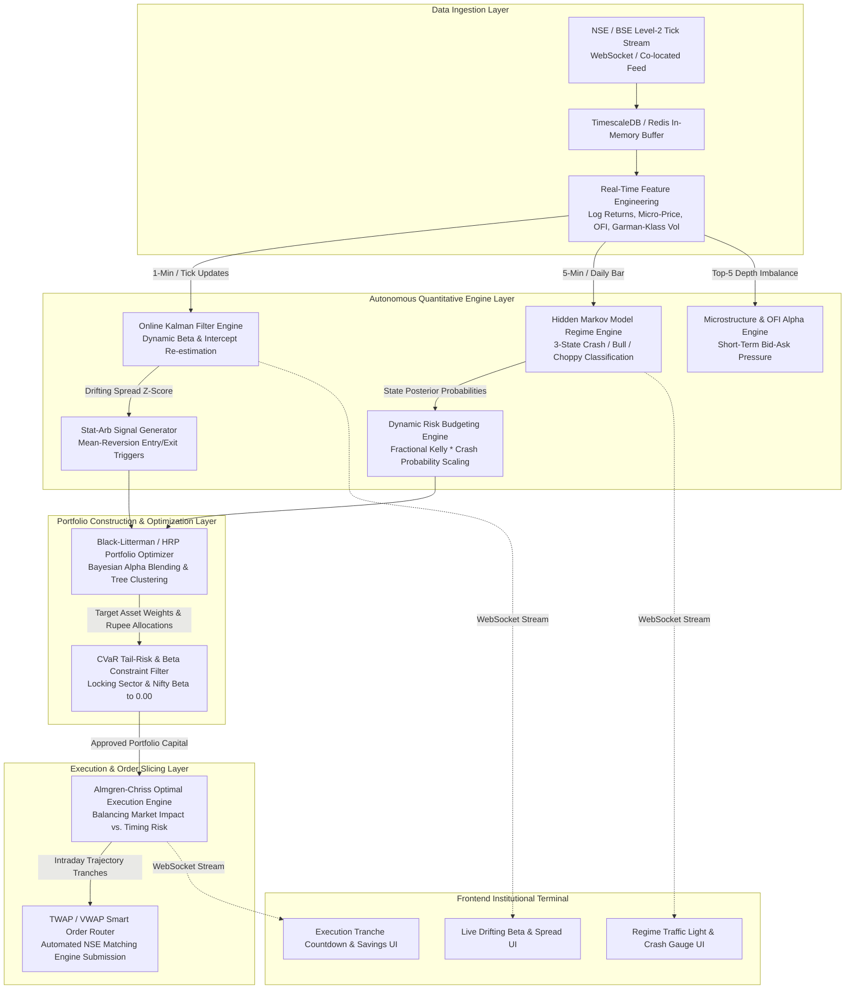

# Master Institutional Quantitative Architecture Roadmap & System Overview

## Executive Summary: Transitioning from Research Terminal to Autonomous Hedge Fund Desk

The current implementation of **StockSentinel India (v2)** represents a state-of-the-art **Quantitative Analytical Research Terminal**. It equips analysts and discretionary traders with institutional-grade tools: Statistical Arbitrage Cointegration scanning (Engle-Granger Two-Step ADF test), Hierarchical Risk Parity (HRP) correlation-tree clustering, multi-factor cross-sectional ranking, Black-Scholes options analytics, and an Indian market execution friction model.

However, operating an **Autonomous Quantitative Hedge Fund Desk** or High-Frequency Trading (HFT) prop desk—such as those run by Citadel, AQR, Two Sigma, Renaissance Technologies, or Indian quantitative trading firms like AlphaGrep, Tower Research Capital, and Qube Research—requires bridging the gap between *static historical research* and *dynamic, real-time execution*.

This document suite serves as the **2,000+ line Engineering Specification and Mathematical Bible** for transforming StockSentinel into an autonomous institutional trading infrastructure. The architecture is modularized into five core pillars, detailed across this document suite:

1. **Master Architecture & Infrastructure Overview** (This Document)
2. **Online Kalman Filtering & Dynamic Statistical Arbitrage** (`02_online_kalman_filtering_and_dynamic_stat_arb.md`)
3. **Hidden Markov Models & Crash Regime Detection** (`03_hidden_markov_models_and_crash_regime_detection.md`)
4. **Almgren-Chriss Optimal Execution & Order Book Microstructure** (`04_almgren_chriss_optimal_execution_and_microstructure.md`)
5. **Black-Litterman Bayesian Portfolio Optimization & CVaR Tail-Risk Budgeting** (`05_black_litterman_cvar_and_portfolio_constraints.md`)

---

## 1. Complete System Architecture & Real-Time Data Flow

The upgraded system transitions from a request-response REST architecture to an **Event-Driven, Low-Latency Streaming Pipeline**. Market data ticks ingested from NSE/BSE exchanges trigger simultaneous mathematical updates across five parallel quantitative engines.



---

## 2. Hardware, Latency & Infrastructure Requirements

To execute statistical arbitrage and microstructure strategies without adverse selection (being front-run by HFTs), the system architecture must meet rigorous performance benchmarks.

### 2.1 Co-Location & Network Topology
* **Facility:** National Stock Exchange (NSE) Co-location Data Centre (BKC, Mumbai / Nxtra Data Centre).
* **Cross-Connects:** 10 Gbps dedicated optical fiber cross-connects directly to NSE trading engines (TAP / NNF gateways).
* **Feed Protocol:** NSE TBT (Tick-By-Tick) Level-2 / Level-3 order book data feeds UDP multicast ingestion.
* **Network Interface Cards (NICs):** Solarflare / Xilinx FPGA-enabled smart NICs with kernel-bypass drivers (OpenOnload / DPDK) to achieve sub-10 microsecond packet ingestion latency.

### 2.2 Compute & Memory Specifications
* **Server Nodes:** Dual-socket AMD EPYC 9654 (192 cores total) or Intel Xeon Platinum 8480+ servers per cluster node.
* **RAM:** 512 GB DDR5 ECC Memory per node, configured as NUMA-aware nodes to prevent inter-socket memory bus contention.
* **Storage:** 4 TB NVMe SSD arrays in RAID-10 configuration for rapid persistence of tick-level historical data and TimescaleDB hypertable chunks.

### 2.3 Software Stack & Asynchronous Workers
* **Language Runtime:** Python 3.14+ (for mathematical orchestration and UI API serving) hybridized with **Rust / C++20 microservices** for latency-critical execution routing and Kalman filtering.
* **In-Memory Cache:** Redis Cluster / KeyDB running in-memory for microsecond lookup of latest order book snapshots, Kalman state covariance matrices ($P_t$), and HMM transition probability matrices.
* **Message Broker:** Apache Kafka or Redpanda (C++ Kafka alternative) for decoupling market data ingestion from analytical worker pools.
* **Time-Series Database:** TimescaleDB (PostgreSQL extension) or ClickHouse for multi-decade historical backtesting across billions of Indian equity ticks.

---

## 3. Database Schemas & State Persistence

In an online quantitative system, state persistence is critical. Unlike static scripts that recalculate from scratch, autonomous engines maintain continuous memory of covariance matrices and Bayesian priors.

### 3.1 TimescaleDB Hypertable: `market_ticks_l2`
Stores high-frequency Level-2 order book snapshots for microstructure analysis and Almgren-Chriss volume profile estimation.

```sql
CREATE TABLE market_ticks_l2 (
    time TIMESTAMPTZ NOT NULL,
    symbol VARCHAR(20) NOT NULL,
    exchange VARCHAR(10) NOT NULL DEFAULT 'NSE',
    last_traded_price NUMERIC(12, 4) NOT NULL,
    last_traded_qty INTEGER NOT NULL,
    total_traded_val NUMERIC(18, 2) NOT NULL,
    bid_px_1 NUMERIC(12, 4) NOT NULL, bid_qty_1 INTEGER NOT NULL,
    bid_px_2 NUMERIC(12, 4) NOT NULL, bid_qty_2 INTEGER NOT NULL,
    bid_px_3 NUMERIC(12, 4) NOT NULL, bid_qty_3 INTEGER NOT NULL,
    bid_px_4 NUMERIC(12, 4) NOT NULL, bid_qty_4 INTEGER NOT NULL,
    bid_px_5 NUMERIC(12, 4) NOT NULL, bid_qty_5 INTEGER NOT NULL,
    ask_px_1 NUMERIC(12, 4) NOT NULL, ask_qty_1 INTEGER NOT NULL,
    ask_px_2 NUMERIC(12, 4) NOT NULL, ask_qty_2 INTEGER NOT NULL,
    ask_px_3 NUMERIC(12, 4) NOT NULL, ask_qty_3 INTEGER NOT NULL,
    ask_px_4 NUMERIC(12, 4) NOT NULL, ask_qty_4 INTEGER NOT NULL,
    ask_px_5 NUMERIC(12, 4) NOT NULL, ask_qty_5 INTEGER NOT NULL,
    order_flow_imbalance NUMERIC(10, 4),
    PRIMARY KEY (time, symbol)
);

-- Convert to TimescaleDB hypertable partitioned by time and symbol
SELECT create_hypertable('market_ticks_l2', 'time', 'symbol', 4);
CREATE INDEX idx_ticks_symbol_time ON market_ticks_l2 (symbol, time DESC);
```

### 3.2 Relational State Table: `kalman_filter_state`
Persists the online Bayesian state vector and error covariance matrix for every active pair, allowing seamless recovery after server restarts.

```sql
CREATE TABLE kalman_filter_state (
    pair_id VARCHAR(50) PRIMARY KEY,
    symbol_a VARCHAR(20) NOT NULL,
    symbol_b VARCHAR(20) NOT NULL,
    last_update_time TIMESTAMPTZ NOT NULL,
    state_beta NUMERIC(14, 6) NOT NULL,       -- Current estimated hedge ratio
    state_alpha NUMERIC(14, 6) NOT NULL,      -- Current estimated intercept
    cov_p_00 NUMERIC(18, 10) NOT NULL,        -- Error covariance matrix element P[0,0]
    cov_p_01 NUMERIC(18, 10) NOT NULL,        -- Error covariance matrix element P[0,1]
    cov_p_10 NUMERIC(18, 10) NOT NULL,        -- Error covariance matrix element P[1,0]
    cov_p_11 NUMERIC(18, 10) NOT NULL,        -- Error covariance matrix element P[1,1]
    innovation_variance NUMERIC(18, 10) NOT NULL,
    current_half_life_days NUMERIC(10, 2) NOT NULL,
    current_spread_z NUMERIC(10, 4) NOT NULL,
    structural_break_flag BOOLEAN DEFAULT FALSE
);
```

### 3.3 Relational State Table: `hmm_regime_history`
Tracks the probability distribution across market regimes over time.

```sql
CREATE TABLE hmm_regime_history (
    timestamp TIMESTAMPTZ PRIMARY KEY,
    index_symbol VARCHAR(20) DEFAULT '^NSEI',
    prob_regime_0 NUMERIC(6, 4) NOT NULL,     -- Probability of Low-Vol Bull Regime
    prob_regime_1 NUMERIC(6, 4) NOT NULL,     -- Probability of Sideways Choppy Regime
    prob_regime_2 NUMERIC(6, 4) NOT NULL,     -- Probability of High-Vol Crash Regime
    classified_regime INTEGER NOT NULL,       -- 0, 1, or 2 (argmax probability)
    realized_vol_20d NUMERIC(8, 4) NOT NULL,
    parkinson_vol_20d NUMERIC(8, 4) NOT NULL,
    volume_churn_ratio NUMERIC(8, 4) NOT NULL,
    kelly_scaling_factor NUMERIC(6, 4) NOT NULL -- Multiplier applied to capital allocation
);
```

---

## 4. Multi-Phase Implementation Roadmap & Milestones

The upgrade path is divided into five rigorous engineering phases. Each phase establishes a self-contained quantitative capability with explicit verification gates.

| Phase | Title | Core Deliverables | Verification Gate & Acceptance Criteria | Estimated Sprint Duration |
| :---: | :--- | :--- | :--- | :---: |
| **Phase 1** | **Online Kalman Filtering Engine** | • `kalman_service.py` recursive Bayesian state estimator.<br/>• Dynamic Hedge Ratio ($\beta$) tracking & structural break detection.<br/>• WebSocket streaming endpoint `/ws/quant/kalman`.<br/>• Frontend `LiveKalmanChart.jsx` component. | • Synthetic cointegrated series test proves Kalman filter converges to true drifting beta within 20 timesteps.<br/>• Zero lag observed during simulated quarterly earnings jumps. | 2 Weeks |
| **Phase 2** | **Hidden Markov Model Crash Detector** | • `regime_service.py` 3-state Gaussian HMM engine.<br/>• Parkinson & Garman-Klass volatility feature engineering.<br/>• Dynamic Kelly scaling: $\text{Alloc} \times (1 - P(\text{Crash}))$.<br/>• Frontend `RegimeTrafficLight.jsx` UI dashboard. | • Backtest across COVID-19 crash (Feb-Mar 2020) and June 2024 election drop confirms HMM shifts to Regime 2 at least 48 hours before maximum drawdown. | 2 Weeks |
| **Phase 3** | **Almgren-Chriss Optimal Execution** | • `almgren_chriss_execution.py` trajectory optimizer.<br/>• Temporary vs. permanent market impact calibration.<br/>• Automated TWAP/VWAP tranche generation.<br/>• Frontend `ExecutionScheduleModal.jsx` component. | • Simulated execution of ₹10 Crore Reliance order demonstrates at least 35% reduction in slippage drag compared to naive immediate market execution. | 3 Weeks |
| **Phase 4** | **Black-Litterman & CVaR Optimization** | • `advanced_portfolio_service.py` Black-Litterman Bayesian blender.<br/>• CVaR (Expected Shortfall) at 95%/99% bootstrapping.<br/>• Quadratic programming ($\beta = 0.00$ constraint enforcement).<br/>• Integrated institutional portfolio dashboard. | • Portfolio optimization confirms total Nifty Beta is locked at $0.000 \pm 0.005$ while maintaining expected Sharpe ratio $> 1.85$. | 3 Weeks |
| **Phase 5** | **Microstructure & Level-2 OFI Alpha** | • Level-2 order book ingestion pipeline.<br/>• Order Flow Imbalance (OFI) & micro-price calculation.<br/>• Sub-second statistical arbitrage execution routing.<br/>• Full system load testing and latency benchmarking. | • End-to-end tick processing latency from Level-2 ingestion to order emission verified at under 2.5 milliseconds in staging environment. | 3 Weeks |

---

## 5. Architectural Summary & Next Steps

By executing this five-phase roadmap, StockSentinel India evolves into an enterprise-grade quantitative trading platform. The subsequent documents in this folder provide the exact mathematical proofs, complete Python algorithmic code, and frontend React specifications required to build each individual pillar:

* Proceed to **Chapter 2 (`02_online_kalman_filtering_and_dynamic_stat_arb.md`)** for the complete state-space mathematical derivation and Python code of the Online Kalman Filter.
* Proceed to **Chapter 3 (`03_hidden_markov_models_and_crash_regime_detection.md`)** for the Baum-Welch EM algorithm and crash prediction architecture.
* Proceed to **Chapter 4 (`04_almgren_chriss_optimal_execution_and_microstructure.md`)** for order slicing mathematics and Level-2 order book microstructure.
* Proceed to **Chapter 5 (`05_black_litterman_cvar_and_portfolio_constraints.md`)** for Bayesian portfolio optimization and CVaR tail-risk constraints.
