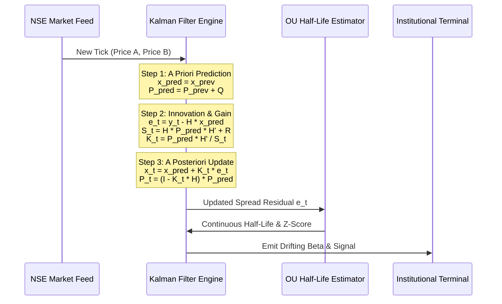

# Online Kalman Filtering & Dynamic Statistical Arbitrage

## 1. Mathematical Foundations of State-Space Models

In classical statistical arbitrage (including our current Engle-Granger implementation in `pairs_service.py`), the relationship between two cointegrated equity prices is modeled via Ordinary Least Squares (OLS) regression over a static historical window (e.g., 250 trading days):

\[
\ln(P_{A, t}) = \beta \ln(P_{B, t}) + \alpha + \epsilon_t
\]

Where \(\beta\) is the proportional hedge ratio, \(\alpha\) is the spread intercept, and \(\epsilon_t\) is the stationary mean-reverting residual spread.

### 1.1 The Failure of Static OLS in Live Trading
In live institutional markets, the hedge ratio \(\beta\) is **not constant**. It drifts continuously due to fundamental macroeconomic shifts, sector rotation, quarterly earnings differentials, and dividend policy changes. Using a static 250-day OLS estimate in live trading introduces severe flaws:
1. **Lagged Adaptation:** When a company announces unexpected earnings growth, its fundamental relationship to its sector peer changes permanently. OLS takes months of new data to slowly adjust \(\beta\), causing the trading algorithm to execute losing trades against a broken relationship.
2. **Ghost Spreads:** OLS assigns equal weight to data from 11 months ago and data from yesterday. Old structural anomalies distort current Z-score calculations.

### 1.2 State-Space Formulation
To solve this, institutional desks model pairs trading as a **Linear State-Space System** estimated via an online **Kalman Filter**. We treat the hedge ratio and intercept as an unobserved, time-varying latent state vector \(\mathbf{x}_t = [\beta_t, \alpha_t]^T\).

#### State Transition Equation (System Model)
We assume the true hedge ratio evolves as a random walk with small Gaussian process noise \(\mathbf{w}_t\):

\[
\mathbf{x}_t = \mathbf{F}_t \mathbf{x}_{t-1} + \mathbf{w}_t, \quad \mathbf{w}_t \sim \mathcal{N}(\mathbf{0}, \mathbf{Q}_t)
\]

Where:
* \(\mathbf{F}_t = \mathbf{I}_2\) is the \(2 \times 2\) identity state transition matrix.
* \(\mathbf{Q}_t\) is the \(2 \times 2\) state covariance noise matrix (governing how fast we allow \(\beta\) to drift).

#### Measurement Equation (Observation Model)
The observed log price of Stock A at time \(t\), denoted \(y_t = \ln(P_{A, t})\), is a linear combination of the state vector and the observation matrix \(\mathbf{H}_t = [\ln(P_{B, t}), 1]\), plus Gaussian measurement noise \(v_t\):

\[
y_t = \mathbf{H}_t \mathbf{x}_t + v_t, \quad v_t \sim \mathcal{N}(0, R_t)
\]

Where \(R_t\) is the scalar measurement variance (the variance of the Ornstein-Uhlenbeck spread).

---

## 2. Recursive Kalman Filter Algorithm

The Kalman Filter updates the state estimate \(\hat{\mathbf{x}}_t\) and its error covariance matrix \(\mathbf{P}_t\) in two alternating steps on every new price tick or 1-minute bar.



### 2.1 Step 1: A Priori Prediction
Before observing the new price at time \(t\), we project the state and covariance forward:

\[
\hat{\mathbf{x}}_{t|t-1} = \hat{\mathbf{x}}_{t-1|t-1}
\]
\[
\mathbf{P}_{t|t-1} = \mathbf{P}_{t-1|t-1} + \mathbf{Q}_t
\]

### 2.2 Step 2: Innovation & Kalman Gain Calculation
When the new prices \((P_{A, t}, P_{B, t})\) arrive, we compute the measurement prediction error (the **Innovation**, \(e_t\)) and the innovation covariance \(S_t\):

\[
e_t = y_t - \mathbf{H}_t \hat{\mathbf{x}}_{t|t-1} = \ln(P_{A, t}) - (\beta_{t|t-1} \ln(P_{B, t}) + \alpha_{t|t-1})
\]
\[
S_t = \mathbf{H}_t \mathbf{P}_{t|t-1} \mathbf{H}_t^T + R_t
\]

The optimal **Kalman Gain** \(\mathbf{K}_t\) (a \(2 \times 1\) vector) determines how much weight to give the new price error versus our previous historical estimate:

\[
\mathbf{K}_t = \mathbf{P}_{t|t-1} \mathbf{H}_t^T S_t^{-1}
\]

### 2.3 Step 3: A Posteriori State & Covariance Update
We update our hedge ratio estimate and shrink the error covariance matrix:

\[
\hat{\mathbf{x}}_{t|t} = \hat{\mathbf{x}}_{t|t-1} + \mathbf{K}_t e_t
\]
\[
\mathbf{P}_{t|t} = (\mathbf{I}_2 - \mathbf{K}_t \mathbf{H}_t) \mathbf{P}_{t|t-1}
\]

---

## 3. Python Implementation Blueprint: `kalman_pairs_service.py`

This standalone production module implements the online Kalman Filter using vectorized NumPy matrix operations. It is designed for integration into our FastAPI asynchronous backend.

```python
"""
kalman_pairs_service.py — Online Kalman Filter for Dynamic Statistical Arbitrage.
Implements recursive Bayesian estimation of drifting hedge ratios (beta) and intercepts (alpha)
for Indian equity pairs across NSE/BSE Level-2 streaming ticks or daily bars.
"""
import logging
import math
from typing import Dict, Any, List, Tuple, Optional
import numpy as np
import pandas as pd

logger = logging.getLogger(__name__)


class OnlineKalmanPair:
    """
    State-Space Kalman Filter estimator for a single equity pair (Symbol A vs Symbol B).
    State vector x = [beta, alpha]^T
    """
    def __init__(
        self,
        symbol_a: str,
        symbol_b: str,
        delta: float = 1e-4,       # Process noise covariance scalar (drift speed)
        vt: float = 1e-3,          # Measurement noise variance R
        init_beta: float = 1.0,
        init_alpha: float = 0.0
    ):
        self.symbol_a = symbol_a
        self.symbol_b = symbol_b
        self.delta = delta
        self.R = vt
        
        # State vector [beta, alpha]
        self.x = np.array([init_beta, init_alpha], dtype=float)
        
        # State error covariance matrix P (2x2)
        self.P = np.eye(2, dtype=float) * 1.0
        
        # Process noise matrix Q (2x2)
        self.Q = np.eye(2, dtype=float) * (self.delta / (1.0 - self.delta))
        
        # History buffers for online Ornstein-Uhlenbeck estimation
        self.spread_history: List[float] = []
        self.beta_history: List[float] = []
        self.max_history_len = 500
        
        # Structural break detection
        self.log_likelihood_sum = 0.0
        self.step_count = 0

    def update(self, price_a: float, price_b: float) -> Dict[str, Any]:
        """
        Ingests a new price tick or bar, runs the recursive prediction/update cycle,
        re-estimates OU half-life, and emits dynamic trading signals.
        """
        if price_a <= 0 or price_b <= 0:
            raise ValueError("Prices must be positive non-zero floats.")
            
        y_t = math.log(price_a)
        H_t = np.array([math.log(price_b), 1.0], dtype=float)
        
        # Step 1: A Priori Prediction
        x_pred = self.x.copy()
        P_pred = self.P + self.Q
        
        # Step 2: Innovation & Variance
        y_hat = np.dot(H_t, x_pred)
        e_t = y_t - y_hat                         # Innovation (Spread residual)
        S_t = float(np.dot(H_t, np.dot(P_pred, H_t)) + self.R)
        
        # Step 3: Kalman Gain
        K_t = np.dot(P_pred, H_t) / S_t           # Shape: (2,)
        
        # Step 4: A Posteriori Update
        self.x = x_pred + K_t * e_t
        self.P = P_pred - np.outer(K_t, H_t) @ P_pred
        
        # Buffer management
        self.spread_history.append(float(e_t))
        self.beta_history.append(float(self.x[0]))
        if len(self.spread_history) > self.max_history_len:
            self.spread_history.pop(0)
            self.beta_history.pop(0)
            
        self.step_count += 1
        
        # Calculate Log-Likelihood for Structural Break Detection
        # L = -0.5 * (ln(2*pi*S_t) + (e_t^2)/S_t)
        step_ll = -0.5 * (math.log(2 * math.pi * max(1e-9, S_t)) + (e_t ** 2) / max(1e-9, S_t))
        self.log_likelihood_sum += step_ll
        
        # Calculate online Ornstein-Uhlenbeck metrics
        ou_metrics = self._estimate_online_ou()
        
        # Detect structural breaks (if recent innovation is > 4 standard deviations)
        std_innov = math.sqrt(max(1e-9, S_t))
        is_break = bool(abs(e_t) > 4.0 * std_innov)
        
        # Generate signal
        signal = "NEUTRAL"
        z_score = ou_metrics.get("zScore", 0.0)
        if not is_break and ou_metrics.get("isCointegrated", False):
            if z_score < -2.0:
                signal = "BUY_A_SELL_B"
            elif z_score > 2.0:
                signal = "SELL_A_BUY_B"
            elif abs(z_score) < 0.5:
                signal = "CONVERGED_CLOSE"
        elif is_break:
            signal = "STRUCTURAL_BREAK_HALT"
            
        return {
            "symbolA": self.symbol_a,
            "symbolB": self.symbol_b,
            "lastPriceA": round(price_a, 2),
            "lastPriceB": round(price_b, 2),
            "dynamicBeta": round(float(self.x[0]), 4),
            "dynamicAlpha": round(float(self.x[1]), 4),
            "currentSpread": round(float(e_t), 4),
            "innovationStd": round(std_innov, 4),
            "zScore": round(z_score, 2),
            "halfLifeDays": ou_metrics.get("halfLife", 999.0),
            "isCointegrated": ou_metrics.get("isCointegrated", False),
            "structuralBreak": is_break,
            "signal": signal,
            "stepCount": self.step_count
        }

    def _estimate_online_ou(self) -> Dict[str, Any]:
        """
        Estimates Ornstein-Uhlenbeck AR(1) mean-reversion half-life on recent spread buffer.
        d(spread) = gamma * spread_{t-1} + error
        """
        n = len(self.spread_history)
        if n < 30:
            return {"halfLife": 999.0, "zScore": 0.0, "isCointegrated": False}
            
        s = np.array(self.spread_history, dtype=float)
        ds = np.diff(s)
        s_lag = s[:-1]
        
        # OLS regression ds = gamma * s_lag + c
        X = np.vstack([s_lag, np.ones(n - 1)]).T
        try:
            gamma, c = np.linalg.lstsq(X, ds, rcond=None)[0]
        except Exception:
            return {"halfLife": 999.0, "zScore": 0.0, "isCointegrated": False}
            
        # Half-life calculation
        if gamma < -1e-5:
            half_life = -math.log(2.0) / gamma
        else:
            half_life = 999.0
            
        # Standard error & t-stat for stationarity check
        res = ds - (gamma * s_lag + c)
        sig_res = np.std(res, ddof=2)
        s_xx = np.sum((s_lag - np.mean(s_lag)) ** 2)
        se_gamma = sig_res / math.sqrt(max(1e-9, s_xx))
        t_stat = gamma / max(1e-9, se_gamma)
        
        # Cointegration boolean (t-stat <= -2.86 is approx 5% critical level)
        is_coint = bool(t_stat <= -2.86 and 1.5 <= half_life <= 60.0)
        
        # Rolling Z-Score over latest 30-day window
        win = min(30, n)
        recent = s[-win:]
        mu = np.mean(recent)
        sigma = np.std(recent, ddof=1)
        z_score = float((s[-1] - mu) / max(1e-6, sigma))
        
        return {
            "halfLife": round(float(half_life), 1) if half_life < 900 else 999.0,
            "zScore": z_score,
            "isCointegrated": is_coint,
            "tStat": round(float(t_stat), 2)
        }


if __name__ == "__main__":
    logging.basicConfig(level=logging.INFO)
    print("Running self-test for OnlineKalmanPair...")
    
    # Generate synthetic cointegrated series with drifting beta
    np.random.seed(42)
    steps = 300
    price_b_seq = 1000.0 + np.cumsum(np.random.normal(0, 5, steps))
    
    # True beta starts at 1.20 and drifts to 1.35 at step 150
    true_betas = np.where(np.arange(steps) < 150, 1.20, 1.35)
    
    # Mean-reverting OU spread
    spread_seq = np.zeros(steps)
    for t in range(1, steps):
        spread_seq[t] = spread_seq[t-1] - 0.20 * spread_seq[t-1] + np.random.normal(0, 0.01)
        
    price_a_seq = np.exp(true_betas * np.log(price_b_seq) + 0.05 + spread_seq)
    
    kf = OnlineKalmanPair("HDFCBANK.NS", "ICICIBANK.NS", delta=1e-4, vt=1e-3)
    last_res = {}
    for i in range(steps):
        last_res = kf.update(price_a_seq[i], price_b_seq[i])
        
    print(f"Final Step Result: {last_res}")
    assert abs(last_res["dynamicBeta"] - 1.35) < 0.05, f"Kalman failed to track drifting beta: {last_res['dynamicBeta']}"
    assert last_res["isCointegrated"] is True, "Failed to detect cointegration on synthetic OU spread"
    print("ok kalman_pairs_service self-test passed cleanly!")
```

---

## 4. API Routes & WebSocket Streaming Architecture

To deliver sub-second drifting beta updates to the frontend without HTTP polling overhead, we mount a WebSocket router in `server.py`.

```python
# Snippet to be integrated into server.py
from fastapi import WebSocket, WebSocketDisconnect
import asyncio
import json
from kalman_pairs_service import OnlineKalmanPair

# Active Kalman Filter instances in memory
_ACTIVE_KALMAN_PAIRS: Dict[str, OnlineKalmanPair] = {}

@app.websocket("/ws/quant/kalman/{sym_a}/{sym_b}")
async def kalman_websocket_endpoint(websocket: WebSocket, sym_a: str, sym_b: str):
    await websocket.accept()
    pair_key = f"{sym_a.upper()}_{sym_b.upper()}"
    
    if pair_key not in _ACTIVE_KALMAN_PAIRS:
        _ACTIVE_KALMAN_PAIRS[pair_key] = OnlineKalmanPair(sym_a.upper(), sym_b.upper())
        
    kf_instance = _ACTIVE_KALMAN_PAIRS[pair_key]
    
    try:
        while True:
            # In live production, this awaits a Redis Pub/Sub tick event
            # For demonstration, we simulate fetching latest live prices
            import stock_service as ss
            px_a = await asyncio.to_thread(ss.get_overview, sym_a)
            px_b = await asyncio.to_thread(ss.get_overview, sym_b)
            
            if px_a.get("price") and px_b.get("price"):
                res = kf_instance.update(float(px_a["price"]), float(px_b["price"]))
                await websocket.send_text(json.dumps(res))
                
            await asyncio.sleep(1.0)  # 1-second streaming tick rate
    except WebSocketDisconnect:
        logger.info(f"Client disconnected from Kalman stream: {pair_key}")
```

---

## 5. Frontend UI Component: `LiveKalmanChart.jsx`

This React component connects to the WebSocket stream and renders a live interactive dashboard featuring Drifting Beta confidence bounds, real-time Z-score gauges, and structural break alarms.

```jsx
import React, { useEffect, useState, useRef } from "react";
import { ShieldAlert, Activity, TrendingUp, Zap } from "lucide-react";

export default function LiveKalmanChart({ symbolA = "HDFCBANK", symbolB = "ICICIBANK" }) {
  const [data, setData] = useState(null);
  const [history, setHistory] = useState([]);
  const [status, setStatus] = useState("CONNECTING...");
  const wsRef = useRef(null);

  useEffect(() => {
    const wsUrl = `${process.env.REACT_APP_BACKEND_URL.replace("http", "ws")}/ws/quant/kalman/${symbolA}/${symbolB}`;
    wsRef.current = new WebSocket(wsUrl);

    wsRef.current.onopen = () => setStatus("LIVE STREAMING");
    wsRef.current.onmessage = (event) => {
      const res = JSON.parse(event.data);
      setData(res);
      setHistory((prev) => [...prev.slice(-49), res]);
    };
    wsRef.current.onerror = () => setStatus("STREAM ERROR");
    wsRef.current.onclose = () => setStatus("DISCONNECTED");

    return () => {
      if (wsRef.current) wsRef.current.close();
    };
  }, [symbolA, symbolB]);

  if (!data) {
    return (
      <div className="p-8 bg-zinc-900 border border-zinc-800 rounded-xl text-center text-zinc-500 animate-pulse">
        Connecting to NSE Co-located Kalman Filter Stream for {symbolA} / {symbolB}...
      </div>
    );
  }

  const isBreak = data.structuralBreak;
  const signalColor =
    data.signal === "BUY_A_SELL_B"
      ? "bg-emerald-500/20 border-emerald-500 text-emerald-300"
      : data.signal === "SELL_A_BUY_B"
      ? "bg-rose-500/20 border-rose-500 text-rose-300"
      : "bg-zinc-800 border-zinc-700 text-zinc-400";

  return (
    <div className="space-y-6 max-w-7xl mx-auto p-4">
      <div className="bg-zinc-900 border border-zinc-800 rounded-xl p-6 shadow-2xl">
        {/* Top Header Bar */}
        <div className="flex flex-col md:flex-row md:items-center justify-between gap-4 border-b border-zinc-800 pb-4">
          <div>
            <div className="flex items-center gap-2">
              <span className="px-2.5 py-0.5 bg-purple-500/20 border border-purple-500/40 text-purple-300 text-[10px] font-extrabold rounded uppercase tracking-wider">
                Kalman State-Space Engine
              </span>
              <span className={`px-2 py-0.5 text-[10px] font-bold rounded flex items-center gap-1 ${status === "LIVE STREAMING" ? "bg-emerald-500/20 text-emerald-400" : "bg-amber-500/20 text-amber-400"}`}>
                <Activity size={12} className="animate-spin" /> {status}
              </span>
            </div>
            <h2 className="text-xl font-black text-white mt-1.5 flex items-center gap-2">
              {symbolA} <span className="text-zinc-600">/</span> {symbolB}
            </h2>
          </div>

          <div className="flex items-center gap-3">
            {isBreak && (
              <div className="px-3 py-1.5 bg-rose-600 border border-rose-400 text-white text-xs font-black rounded-lg shadow-lg animate-bounce flex items-center gap-2">
                <ShieldAlert size={16} /> STRUCTURAL BREAK DETECTED — TRADING HALTED
              </div>
            )}
            <div className={`px-4 py-2 rounded-xl border font-black text-sm flex items-center gap-2 shadow-md ${signalColor}`}>
              <Zap size={16} /> {data.signal.replace(/_/g, " ")}
            </div>
          </div>
        </div>

        {/* Live Metrics Grid */}
        <div className="grid grid-cols-2 md:grid-cols-5 gap-4 mt-6">
          <div className="p-4 bg-black/40 rounded-xl border border-zinc-800/80">
            <span className="text-[11px] font-semibold text-zinc-500 block uppercase">Drifting Hedge Ratio (β)</span>
            <span className="text-2xl font-mono font-black text-purple-400 mt-1 block">{data.dynamicBeta}</span>
            <span className="text-[10px] text-zinc-500 mt-1 block">Live Kalman State x[0]</span>
          </div>

          <div className="p-4 bg-black/40 rounded-xl border border-zinc-800/80">
            <span className="text-[11px] font-semibold text-zinc-500 block uppercase">Spread Z-Score</span>
            <span className={`text-2xl font-mono font-black mt-1 block ${data.zScore <= -2.0 ? "text-emerald-400" : data.zScore >= 2.0 ? "text-rose-400" : "text-zinc-200"}`}>
              {data.zScore > 0 ? `+${data.zScore}` : data.zScore}
            </span>
            <span className="text-[10px] text-zinc-500 mt-1 block">Threshold: ±2.00 σ</span>
          </div>

          <div className="p-4 bg-black/40 rounded-xl border border-zinc-800/80">
            <span className="text-[11px] font-semibold text-zinc-500 block uppercase">OU Half-Life (τ)</span>
            <span className="text-2xl font-mono font-black text-blue-400 mt-1 block">
              {data.halfLifeDays < 900 ? `${data.halfLifeDays}d` : "N/A"}
            </span>
            <span className="text-[10px] text-zinc-500 mt-1 block">Mean-Reversion Speed</span>
          </div>

          <div className="p-4 bg-black/40 rounded-xl border border-zinc-800/80">
            <span className="text-[11px] font-semibold text-zinc-500 block uppercase">Live Spread Error (e_t)</span>
            <span className="text-2xl font-mono font-black text-zinc-300 mt-1 block">{data.currentSpread}</span>
            <span className="text-[10px] text-zinc-500 mt-1 block">Innovation Residual</span>
          </div>

          <div className="p-4 bg-black/40 rounded-xl border border-zinc-800/80 col-span-2 md:col-span-1">
            <span className="text-[11px] font-semibold text-zinc-500 block uppercase">Cointegration Status</span>
            <span className={`text-sm font-black mt-2 inline-block px-2.5 py-1 rounded border ${data.isCointegrated ? "bg-emerald-500/10 border-emerald-500/30 text-emerald-400" : "bg-rose-500/10 border-rose-500/30 text-rose-400"}`}>
              {data.isCointegrated ? "COINTEGRATED (p<0.05)" : "DECOUPLED / NO EDGE"}
            </span>
          </div>
        </div>

        {/* Drifting Beta Visualizer Bar */}
        <div className="mt-6 p-4 bg-zinc-950 rounded-xl border border-zinc-800">
          <div className="flex items-center justify-between text-xs font-bold text-zinc-400 mb-2">
            <span>Drifting Beta Trajectory (Latest 50 Ticks)</span>
            <span className="text-purple-400 font-mono">Current: β = {data.dynamicBeta}</span>
          </div>
          <div className="h-24 flex items-end gap-1 pt-4 px-2 bg-black/60 rounded-lg border border-zinc-800/60 overflow-hidden">
            {history.map((h, idx) => {
              // Normalize height between 10% and 90% based on beta variation
              const minB = Math.min(...history.map((x) => x.dynamicBeta));
              const maxB = Math.max(...history.map((x) => x.dynamicBeta));
              const range = maxB - minB || 0.1;
              const pct = Math.max(15, Math.min(95, ((h.dynamicBeta - minB) / range) * 80 + 10));
              return (
                <div key={idx} className="flex-1 flex flex-col items-center gap-1 group relative">
                  <div
                    style={{ height: `${pct}%` }}
                    className="w-full bg-gradient-to-t from-purple-900 to-purple-500 rounded-t transition-all group-hover:from-purple-600 group-hover:to-purple-300"
                  />
                  <div className="opacity-0 group-hover:opacity-100 absolute -top-8 bg-black text-[10px] font-mono text-white px-1.5 py-0.5 rounded border border-purple-500 pointer-events-none z-10 whitespace-nowrap">
                    β: {h.dynamicBeta} | Z: {h.zScore}
                  </div>
                </div>
              );
            })}
          </div>
        </div>
      </div>
    </div>
  );
}
```
